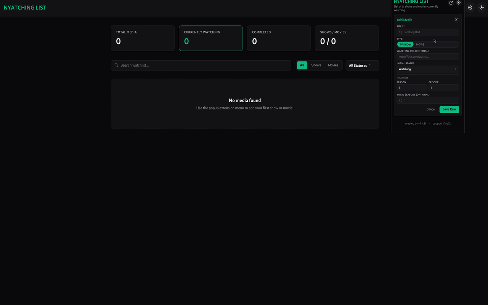

# Nyatching List

[](https://developer.chrome.com/docs/extensions/mv3/intro/)
[](https://vuejs.org/)
[](https://www.typescriptlang.org/)
[](https://vitejs.dev/)
[](https://www.themoviedb.org/)
[](https://opensource.org/licenses/MIT)

A browser extension that helps you keep track of TV shows and movies you are watching.



---

## Installation

| Platform | Link |
| --- | --- |
| **Chrome / Brave / Edge** | [Chrome Web Store](https://chromewebstore.google.com/detail/nyatching-list/lfclngikmpcnhmgmakapkcmlpkbgjcna) |
| **Firefox** | [Firefox Add-ons](https://addons.mozilla.org/en-US/firefox/addon/nyatching-list/) |

---

## Features

- **Watchlist** — Save shows and movies with a status: watching, waiting, completed, or dropped
- **Progress tracking** — Track season/episode for shows, and minutes watched for movies
- **Search** — Find titles with autocomplete powered by [TMDB](https://www.themoviedb.org/)
- **IMDb quick add** — Open the extension on an IMDb title page to pre-fill the form
- **Dashboard** — Browse, filter, and manage your full list in a dedicated tab
- **Notifications** — Get reminded about new seasons and inactive watching items
- **Dark / light theme** — Switch themes from the popup or dashboard
- **Local storage** — Your list stays on your device

---

## How to use

### Add something to your list

1. Click the Nyatching List icon in your browser toolbar
2. Open the add form
3. Search for a title, or type the details yourself
4. Set the status and starting progress, then save

If you are already on an IMDb title page, the form can fill itself in for you.

### Track progress

- **Shows** — Update the current season and episode from the dashboard
- **Movies** — Update how many minutes you have watched
- **Track toggle** — Mark shows you want checked for new seasons

### Dashboard

Open the dashboard from the popup to:

- Search and filter by status or type
- Update progress and status
- Review notification history
- Change notification settings

### Notifications

In settings you can control:

- How often to check for new seasons
- How long before you get a reminder for inactive items
- Turning either reminder off entirely

---

## Privacy

- Your watchlist and settings are stored **locally** in your browser
- The extension does **not** create an account
- Title search and season checks use the public [TMDB API](https://www.themoviedb.org/)
- No personal watchlist data is uploaded to a Nyatching List server

---

## Permissions

| Permission | Why it is needed |
| --- | --- |
| `storage` | Save your watchlist and settings |
| `alarms` | Run periodic season and inactivity checks |
| `notifications` | Show desktop reminders |
| `api.themoviedb.org` | Search titles and check for new seasons |
| `imdb.com` | Detect the current IMDb title page for quick add |

---

## Tech stack

- Vue 3
- TypeScript
- Vite
- Manifest V3
- [webextension-polyfill](https://github.com/mozilla/webextension-polyfill)

---

## Development

```bash
npm install
npm run dev          # Chrome
npm run dev:firefox  # Firefox
```

```bash
npm run build          # Chrome + Firefox
npm run build:chrome   # → build/
npm run build:firefox  # → build-firefox/
```

Load the unpacked extension from the `build` or `build-firefox` folder while developing.

---

## Release Process

This repository uses GitHub Actions to automatically build and release extension packages.

To cut a new release:

1. Update the version number in `package.json` (e.g., `"1.0.1"`).
2. Commit your changes and push a matching Git tag:
```bash
   git add package.json
   git commit -m "chore: release v1.0.1"
   git tag v1.0.1
   git push origin main --tags
```

---

## Contributing

Bug reports and pull requests are welcome. Please keep changes focused and describe what you changed and why.

---

## Credits

This product uses the TMDB API but is not endorsed or certified by TMDB.

Movie and TV metadata and posters come from [The Movie Database (TMDB)](https://www.themoviedb.org/).

---

## Support

- GitHub: [v1nc3t/nyatching-list](https://github.com/v1nc3t/nyatching-list)
- Support the developer: [buymeacoffee.com/v1c3nt](https://buymeacoffee.com/v1c3nt)

---

## License

MIT — see [LICENSE](LICENSE).
